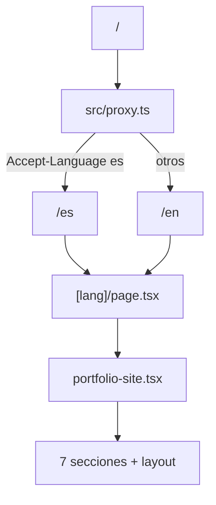

# Análisis de arquitectura y SEO — Molinart Portfolio

Documento de referencia del proyecto **molinart-next** (sitio en producción: [https://www.molinart.net/en](https://www.molinart.net/en)).

**Fecha del análisis:** mayo 2026  
**Alcance:** solo lectura del código y verificación en producción. Sin cambios aplicados al repositorio en el momento de este documento.

---

## 1. Framework y estructura de rutas

| Aspecto | Detalle |
|--------|---------|
| **Framework** | **Next.js 16.2.6** (App Router) + **React 19** + **TypeScript** |
| **Estilos / UI** | Tailwind CSS v4, Framer Motion, Lucide |
| **Backend integrado** | Route Handlers: `/api/chat`, `/api/contact` (Gemini, Supabase, SMTP) |
| **Rutas de página** | Segmento dinámico `src/app/[lang]/` → `/es` y `/en` |
| **Página principal** | `src/app/[lang]/page.tsx` renderiza `<PortfolioSite locale={lang} />` |
| **Layout por idioma** | `src/app/[lang]/layout.tsx` (fuentes, `lang`, metadata) |
| **Redirección raíz** | `src/proxy.ts` redirige `/` → `/es` o `/en` según `Accept-Language` (es → `/es`, resto → `/en`) |
| **Alias de imports** | `@/*` → `src/*`, `@/content/*` → `content/*` |

### Flujo de la aplicación



Es un **single-page portfolio** por idioma: las secciones son anclas (`#home`, `#about`, etc.), no rutas separadas por sección.

### Estructura relevante del repo

```
molinart-next/
├── content/                 # Textos y datos por locale (es/en)
│   ├── i18n.ts
│   ├── site.ts              # Nav, footer, siteMetadata (SEO)
│   ├── hero.ts
│   ├── summary.ts
│   ├── timeline.ts
│   ├── experience.ts
│   ├── technologies.ts
│   ├── ask-emilio.ts
│   ├── contact.ts
│   └── ai-profile-context.ts
├── src/
│   ├── app/
│   │   ├── [lang]/
│   │   │   ├── layout.tsx   # generateMetadata, html lang
│   │   │   └── page.tsx
│   │   ├── api/chat/
│   │   ├── api/contact/
│   │   ├── robots.ts
│   │   └── sitemap.ts
│   ├── components/
│   │   ├── portfolio-site.tsx
│   │   ├── layout/
│   │   └── sections/
│   └── proxy.ts             # Redirect / → /es o /en
└── public/                  # Imágenes, CVs, favicon
```

---

## 2. Dónde está el contenido en inglés y español

El patrón es **contenido tipado en `content/`** + **componentes que consumen `content[locale]`**.

| Archivo | Contenido |
|---------|-----------|
| `content/i18n.ts` | Locales: `es`, `en`; helper `hasLocale()` |
| `content/site.ts` | Navegación, menú, footer, enlaces a CV, **metadatos SEO** (`siteMetadata`) |
| `content/hero.ts` | Hero (saludo, nombre, tagline, subtítulo) |
| `content/summary.ts` | Resumen / About (+ barras de skills) |
| `content/timeline.ts` | Cronología de carrera (paneles por año, HTML embebido) |
| `content/experience.ts` | Experiencia (tarjetas con imágenes) |
| `content/technologies.ts` | Tecnologías (lista de íconos compartida, textos por locale) |
| `content/ask-emilio.ts` | UI del chat Ask Emilio AI |
| `content/contact.ts` | Formulario de contacto |
| `content/ai-profile-context.ts` | Contexto del asistente AI (inglés, solo servidor) |

La navegación y etiquetas de sección viven en `siteContent` dentro de `content/site.ts`.

---

## 3. Dónde se implementan las secciones

**Orquestador:** `src/components/portfolio-site.tsx` monta las 7 secciones en orden.

| Sección | Componente | Contenido | `id` en DOM |
|---------|------------|-----------|-------------|
| **Hero** | `src/components/sections/hero-section.tsx` | `content/hero.ts` | `#home` |
| **Summary / About** | `src/components/sections/summary-section.tsx` | `content/summary.ts` | `#about` |
| **Career Timeline** | `src/components/sections/timeline-section.tsx` + `timeline-horizontal-nav.tsx` | `content/timeline.ts` | `#timeline` |
| **Experience** | `src/components/sections/experience-section.tsx` | `content/experience.ts` | `#experience` |
| **Technologies** | `src/components/sections/technologies-section.tsx` | `content/technologies.ts` | `#technologies` |
| **Ask Emilio AI** | `src/components/sections/ask-emilio-section.tsx` | `content/ask-emilio.ts` + `src/app/api/chat/route.ts` | `#ask-emilio` |
| **Contact** | `src/components/sections/contact-section.tsx` | `content/contact.ts` + `src/app/api/contact/route.ts` | `#contact` |

### Componentes reutilizables de layout

| Componente | Rol |
|------------|-----|
| `section-shell.tsx` | Contenedor de sección (fondo, altura, snap scroll) |
| `section-heading.tsx` | Encabezado común (accent, título, stat) |
| `site-header.tsx` | Header fijo + botón menú |
| `side-menu.tsx` | Menú lateral, idioma, CV, nav |
| `section-nav.tsx` | Navegación lateral por puntos (desktop) |
| `site-footer.tsx` | Footer + redes |
| `social-links.tsx` | Enlaces Facebook, Instagram, LinkedIn |
| `full-page-scroll-context.tsx` | Scroll por secciones en viewport grande |

### APIs relacionadas

| Ruta | Uso |
|------|-----|
| `POST /api/chat` | Ask Emilio AI (Gemini + Supabase + email lead opcional) |
| `POST /api/contact` | Formulario de contacto (Supabase + email) |

---

## 4. Dónde se configura el SEO

| Qué | Dónde |
|-----|--------|
| **Title, description, keywords, OG, canonical, hreflang** | `generateMetadata()` en `src/app/[lang]/layout.tsx` |
| **Textos SEO por idioma** | `siteMetadata` en `content/site.ts` |
| **URL base del sitio** | `siteConfig.url` en `content/site.ts` (actualmente `https://molinart.net`) |
| **`robots.txt`** | `src/app/robots.ts` |
| **`sitemap.xml`** | `src/app/sitemap.ts` |

### Fragmento clave (`layout.tsx`)

```ts
return {
  metadataBase: new URL(siteConfig.url),
  title: metadata.title,
  description: metadata.description,
  authors: [{ name: siteConfig.author }],
  keywords: [...metadata.keywords],
  alternates: {
    canonical: `/${lang}`,
    languages: {
      es: "/es",
      en: "/en",
    },
  },
  openGraph: {
    type: "website",
    locale: metadata.locale,
    url: `/${lang}`,
    siteName: siteConfig.name,
    title: metadata.title,
    description: metadata.description,
  },
};
```

### Metadatos actuales por idioma (`content/site.ts`)

**Español (`es`):**

- **title:** `Molinart | Emilio Molina`
- **description:** Portafolio de Emilio Molina, Principal Software Engineer…
- **locale OG:** `es_MX`
- **keywords:** Emilio Molina, Principal Software Engineer, desarrollo full stack, etc.

**Inglés (`en`):**

- **title:** `Molinart | Emilio Molina` (mismo título que español)
- **description:** Portfolio of Emilio Molina, Principal Software Engineer…
- **locale OG:** `en_US`
- **keywords:** Emilio Molina, Principal Software Engineer, full-stack development, etc.

---

## 5. Soporte de rutas `/en` y `/es`

**Sí, implementado.**

- Rutas generadas con `generateStaticParams()` para `es` y `en`.
- Selector de idioma en header/menú enlaza a `/${alternateLocale}` (p. ej. `/es` ↔ `/en`).
- En producción, `/` redirige según `Accept-Language` (sin cabecera española → `/en` en pruebas con curl).

**URLs de desarrollo (README):**

- Español: `http://localhost:3000/es`
- Inglés: `http://localhost:3000/en`

---

## 6. Estado de implementaciones SEO

Verificado en código y en HTML de producción (`https://www.molinart.net/en`):

| Feature | Estado | Notas |
|---------|--------|-------|
| **Rutas `/en`, `/es`** | ✅ Implementado | |
| **hreflang** | ✅ Parcial | `link rel="alternate" hreflang="es|en"` vía `alternates.languages` |
| **hreflang `x-default`** | ❌ No | Recomendable apuntar a `/en` si se prioriza inglés |
| **Canonical** | ✅ Parcial | Apunta a `https://molinart.net/en` (sin `www`) |
| **Open Graph** | ✅ Parcial | title, description, url, site_name, locale, type |
| **`og:image`** | ❌ No | Importante para compartir en LinkedIn, Slack, etc. |
| **Twitter Cards** | ✅ Básico | Next infiere `twitter:card=summary`, title y description; sin imagen ni `twitter:site` explícitos en código |
| **`robots.txt`** | ✅ | `Allow: /` + referencia al sitemap |
| **`sitemap.xml`** | ✅ Parcial | Solo `/es` y `/en`; **prioridad ES=1.0, EN=0.9** (contrario a priorizar inglés) |
| **JSON-LD** | ❌ No | Sin schema `Person`, `WebSite`, etc. |
| **Dominio www vs apex** | ⚠️ Desalineado | Sitio vivo en `www.molinart.net`; metadatos y sitemap usan `molinart.net` sin `www` |

### Ejemplo de tags en producción (`/en`)

```html
<link rel="canonical" href="https://molinart.net/en"/>
<link rel="alternate" hrefLang="es" href="https://molinart.net/es"/>
<link rel="alternate" hrefLang="en" href="https://molinart.net/en"/>
<meta property="og:title" content="Molinart | Emilio Molina"/>
<meta property="og:description" content="Portfolio of Emilio Molina..."/>
<meta property="og:url" content="https://molinart.net/en"/>
<meta name="twitter:card" content="summary"/>
```

### `sitemap.xml` actual (producción)

```xml
<url>
  <loc>https://molinart.net/es</loc>
  <priority>1</priority>
</url>
<url>
  <loc>https://molinart.net/en</loc>
  <priority>0.9</priority>
</url>
```

### `robots.txt` actual (producción)

```
User-Agent: *
Allow: /

Sitemap: https://molinart.net/sitemap.xml
```

---

## 7. Plan de implementación seguro (antes de cambios)

### Fase 0 — Decisiones (sin código)

1. **Dominio canónico:** ¿`www.molinart.net` o `molinart.net`? Alinear Vercel, `siteConfig.url`, canonical, sitemap y Google Search Console.
2. **Idioma por defecto para SEO:** Si se prioriza inglés → `x-default` → `/en`, subir prioridad de `/en` en sitemap, y valorar redirección de `/` a `/en` (ya ocurre sin `Accept-Language` español).
3. **Alcance de contenido:** ¿Solo metadatos o también copy de secciones + contexto del AI?

### Fase 1 — SEO técnico (bajo riesgo)

1. Actualizar `siteConfig.url` al dominio canónico elegido.
2. En `src/app/[lang]/layout.tsx`:
   - Añadir `alternates.languages['x-default']` → `/en` (si aplica).
   - Añadir `openGraph.images` y bloque `twitter` explícito.
   - Crear imagen OG dedicada (recomendado 1200×630) en `public/images/`.
3. Añadir JSON-LD (`Person` + `WebSite`) en layout o componente server-only.
4. En `src/app/sitemap.ts`: prioridad `en` ≥ `es`; revisar `lastModified`.
5. Verificar redirect 301 único entre www y apex en Vercel.
6. Ejecutar `npm run build` y revisar HTML generado de `/en` y `/es`.

### Fase 2 — Contenido EN (prioridad SEO)

1. Reescribir `siteMetadata.en` (title único, description con keywords: rol, stack, geo si aplica).
2. Revisar copy en inglés: `hero.ts`, `summary.ts`, `timeline.ts`, `experience.ts` (H1/H2, términos buscables).
3. Sincronizar `content/ai-profile-context.ts` con el copy publicado en el sitio.
4. Revisión ligera de español para consistencia, sin perder posicionamiento local.

### Fase 3 — Validación y despliegue

1. Rich Results Test / Schema validator para JSON-LD.
2. Inspección de URL en Google Search Console (ambos idiomas).
3. Probar `/`, `/en`, `/es`, `/robots.txt`, `/sitemap.xml`, previews OG (LinkedIn, Twitter/X).
4. Desplegar; no tocar APIs salvo que cambie el contexto del chat.

### Fase 4 — Opcional (más impacto, más esfuerzo)

- Títulos/descripciones por sección (ganancia limitada en SPA de una página; el mayor impacto sigue en metadata global + copy visible).
- Blog o páginas adicionales (`/en/about`, etc.) si se busca long-tail.
- `hreflang` con códigos regionales (`en-US`, `es-MX`) si lo justifica el mercado.

### Orden recomendado de archivos a editar

1. `content/site.ts`
2. `src/app/[lang]/layout.tsx`
3. `src/app/sitemap.ts`
4. `content/hero.ts` → `summary.ts` → `timeline.ts` → `experience.ts`
5. `content/ai-profile-context.ts`
6. Assets OG en `public/images/`

### Riesgos a evitar

- No cambiar URLs `/en` y `/es` sin redirects 301.
- No duplicar canonical entre `www` y apex.
- No commitear `.env` ni claves.
- Tras cambios de copy, probar `/api/chat` para que el asistente no contradiga el sitio público.

---

## Resumen ejecutivo

El proyecto está bien organizado: **contenido en `content/`**, **UI en `src/components/sections/`**, **SEO centralizado en `layout.tsx` + `content/site.ts`**, e **i18n por ruta** `/en` y `/es`.

La base SEO existe (canonical, hreflang básico, OG, Twitter summary inferido, robots, sitemap), pero hay huecos claros para **priorizar inglés**:

- Desalineación **www vs apex** en URLs canónicas.
- Sin **`og:image`** ni **JSON-LD**.
- **Sitemap** favorece español (priority 1.0 vs 0.9).
- **Metadatos genéricos** (mismo title en ambos idiomas).

Cuando se implementen mejoras, conviene empezar por **Fase 0** (dominio canónico) y **Fase 1** (SEO técnico), y luego el copy en inglés en `content/*.ts`.

---

## Referencias internas

- [README.md](../README.md) — stack, secciones, variables de entorno
- [docs/vercel-deployment.md](./vercel-deployment.md) — despliegue y URLs
- [docs/testing.md](./testing.md) — pruebas de APIs
